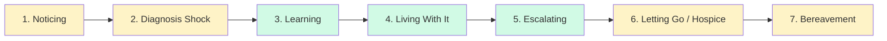
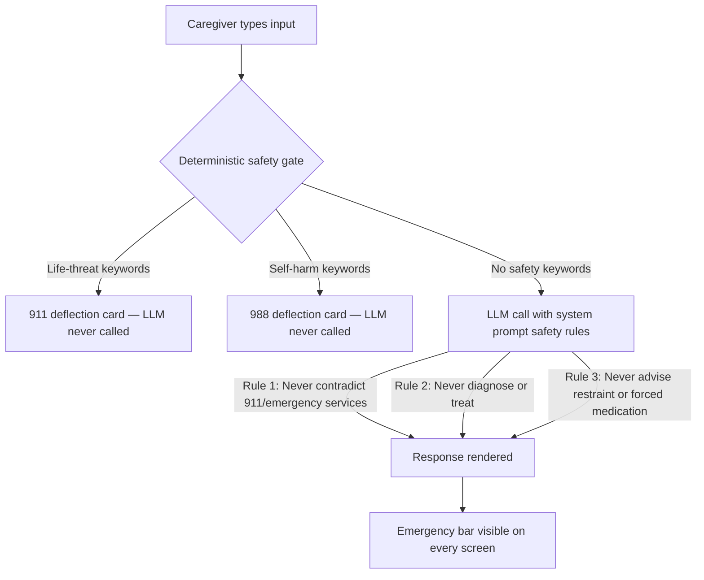

# CalmGuide Product Guide

**Version:** 2026-04-28
**Status:** Living document — update after every major feature release or positioning change
**Audience:** Stakeholders, potential partners, investors, and new team members

---

## Positioning Statement

CalmGuide is a multilingual AI companion for families touched by dementia. It helps with the thousands of ordinary moments between emergencies — learning the disease, getting through a tough evening, and caring for yourself across years of care. It does not handle medical emergencies (call 911), it does not diagnose (call your doctor), and it is not therapy (call a therapist). It complements the Alzheimer's Association 24/7 Helpline at 1-800-272-3900 and never replaces it.

**Tagline:** Walking with dementia families, every day of the journey.

---

## 1. Who Is CalmGuide For?

### Primary Persona — The Adult Daughter Caregiver (ICP)

The primary user CalmGuide is designed around is a woman aged 45–64 caring for a parent — most commonly a mother — with Alzheimer's disease or a related dementia. Research from the Family Caregiver Alliance places 66% of dementia caregivers as female; ASPE data confirms adult daughters are the most common primary caregivers.

**Profile:**
- Age 55–70, often using the app on a mid-range Android or iPhone with reading glasses
- Provides 31 hours per week of unpaid care alongside a full-time job and her own family
- 40% meet clinical criteria for depression; 35% experience anxiety
- Finds help by searching Google, posting in Facebook groups, or calling the Alzheimer's helpline (which receives 800+ calls per day — demand for support is well-documented)
- Often bilingual: a large proportion are first- or second-generation immigrant daughters whose patient speaks a language other than English at home

**What she needs at 3 AM:**
A calm, structured answer — in her language — to a specific situation that just happened. Not a search results page. Not a hold queue. Not a 60-page care manual.

**What she does not need:**
To be told to call 911 when the situation is frightening but not immediately life-threatening. Unnecessary 911 calls contribute to the 1.4 million dementia-related ER visits per year, which are often traumatic for the patient and burn caregiver trust in any tool that triggers them inappropriately.

**Pain points:**
- "I don't know if what I'm seeing is normal for this stage or something I should worry about."
- "I tried redirecting her and it made it worse. What should I have done?"
- "I haven't slept. I snapped at him today. I feel terrible."
- "Everything I find online is in English and talks about 'consulting your physician' — I just need help right now."

### Secondary Personas

**Spouse caregivers (65–80):** Caring for a husband or wife, often managing their own health conditions simultaneously. Typically less fluent with smartphones. Need larger text, simpler navigation, and greater patience in conversational tone. May be further along in the disease journey (Phase 4–5) when they first arrive.

**Long-distance caregivers:** Adult children who coordinate care remotely, visiting monthly or less. Use CalmGuide primarily for learning (Phase 3) — understanding what the on-site caregiver is experiencing and how to have productive conversations during visits. Less likely to use Moment Coach in real-time; more likely to use it to prepare.

**Bilingual / immigrant caregivers:** Caregivers whose patient speaks Tamil, Mandarin, Arabic, French, or another non-English language. Every competitor (except the Alzheimer's helpline, which offers English and Spanish) is English-only. CalmGuide's 11-language support is its primary competitive moat for this segment.

### Who CalmGuide Is NOT For

| Group | Why not | What to use instead |
|---|---|---|
| Patients themselves | CalmGuide's AI is calibrated for caregiver contexts, not patient self-advocacy | Specialized reminiscence or engagement tools |
| Medical professionals | Not a clinical tool; no EHR integration; no medical-grade data | Clinical decision support software |
| Emergency responders | Life-threatening situations require 911, not an app | 911 |
| Researchers | No IRB-approved data sharing or validated instruments | Academic study platforms with consent infrastructure |

---

## 2. The Dementia Caregiver Journey

CalmGuide organizes its features around caregiver experience, not patient clinical stage. Research shows caregivers rarely know the patient's Global Deterioration Scale (GDS) score, but they do recognize their own phase. CalmGuide's seven-phase framework synthesizes the Timing It Right (TIR) framework, the Caregiver-Identified Phases of Alzheimer's Disease (CIP-AD) model, and the Gallagher-Thompson three-stage model.

### The Seven Phases



Green = real AI modes. Yellow = honest deflection to trusted human resources.

### Phase Definitions and CalmGuide's Role

| Phase | Caregiver experience | CalmGuide response |
|---|---|---|
| 1. Noticing | "Something seems different but I don't know if it's serious." | **Deflection** — educational content on warning signs; routes to Alzheimer's Association and "talk to your doctor." CalmGuide does not screen. |
| 2. Diagnosis Shock | "We just got the diagnosis. I don't know what to do." | **Deflection** — emotional acknowledgment, local support group finder, Alzheimer's helpline, planning checklist download. |
| 3. Learning | "I'm trying to understand the disease, what to expect, and how to respond." | **Real mode — Practice Scenarios.** Guided AI scenarios covering behavioral, daily care, safety, communication, and self-care situations. |
| 4. Living With It | "This is daily life now. Tough moments happen. I need help in the moment." | **Real mode — Moment Coach.** Flagship feature. Streaming AI guidance for specific behavioral moments. |
| 5. Escalating | "It's getting harder. I'm not coping well. I'm thinking about facility options." | **Real mode — Check-In.** AI-supported journaling, coping reflection, and caregiver mental health support. |
| 6. Letting Go / Hospice | "We're thinking about hospice and end-of-life decisions." | **Deflection** — routes to Hospice Foundation of America, Alzheimer's Association late-stage care resources, NHPCO. CalmGuide is not equipped for end-of-life decisions. |
| 7. Bereavement | "They're gone. The caregiving is over but the feelings aren't." | **Deflection** — grief resources, GriefShare, 988 Lifeline for acute distress. CalmGuide was built for caregiving, not grief support. |

### Phase Transition Mechanism

Phase assignment is caregiver-initiated and app-suggested — never automatic. The app does not make clinical judgments.

- **At onboarding:** plain-language questions identify the starting phase ("Was there a recent diagnosis?" / "Does daily life still feel manageable?" / "Have you started thinking about hospice?")
- **Every 90 days:** a single check-in question — "How's it going compared to 3 months ago?" — with options: same / a little harder / a lot harder / lost them
- **Passive signal:** if the pattern detector shows a 2x increase in Moment Coach sessions over two weeks, the app gently asks: "We noticed more tough moments lately. Want to take 2 minutes to update things?"
- **User override:** available at any time under Profile settings — "Change where we are in the journey"

The app never moves a user between phases without their confirmation.

---

## 3. Feature Map and User Flows

### Web Route Map

```
/[locale]/
├── home/              — Home screen
├── crisis/            — Moment Coach
├── learn/             — Practice Scenarios list
│   └── [id]/          — Individual scenario interaction
├── check-in/          — Check-In (journaling + AI reflection)
├── impact/            — Impact dashboard
├── profile/           — Profile view
│   └── setup/         — Profile creation wizard
├── journey/
│   ├── noticing/      — Phase 1 deflection
│   ├── diagnosis/     — Phase 2 deflection
│   ├── hospice/       — Phase 6 deflection
│   └── bereavement/   — Phase 7 deflection
├── login/             — Access code entry
├── terms/             — Terms of service
└── privacy/           — Privacy policy
```

### Mobile Route Map

```
(tabs)/
├── home              — Home screen
├── learn             — Practice Scenarios list
└── profile           — Profile view

(stack)/
├── index             — Welcome screen
├── login             — Access code entry
├── crisis            — Moment Coach
├── check-in          — Check-In
├── impact            — Impact dashboard
├── profile/setup     — Profile creation wizard
├── profile/edit      — Edit profile
├── learn/[id]        — Individual scenario
├── journey/
│   ├── noticing
│   ├── diagnosis
│   ├── hospice
│   └── bereavement
├── terms
└── privacy
```

---

### Home Screen

**What it does:** The Home screen is the command center for a caregiver's daily interaction with CalmGuide. It surfaces the most relevant action (Moment Coach), recent conversation history, behavioral pattern insights, and the day's check-in — all personalized to the patient profile.

**Navigation path:** Login with access code > Home (default screen after login)

**Sections (top to bottom):**

| Section | Description |
|---|---|
| Greeting + hero | Time-aware greeting ("Good morning / afternoon / evening") and the message "You're not alone." |
| Patient card | The patient's name (stored locally on-device only), disease stage indicator, and a summary of behavioral patterns on file |
| Moment Coach button | Primary CTA — "Something is happening right now / Get calm, step-by-step guidance." Positioned above the fold at all times |
| Quick actions | Two secondary actions: Practice (Learn scenarios) and Check-In |
| Journey navigation | Four links to phase deflection pages: "Noticing changes?", "New diagnosis", "Thinking about hospice", "After loss" |
| Recent Conversations | Timestamped list of previous Moment Coach sessions; tap to resume |
| Daily Check-In card | Appears when no check-in is logged for the day; records severity (Calm / Mild / Tough episode), time of day, and what helped |
| Tonight's Outlook card | When the pattern detector identifies elevated risk based on episode cycle or trend data, a brief heads-up appears with previously effective strategies |
| Pattern Insights | "Patterns We've Noticed" — rolling summary of peak times, recurring behavioral themes, and what has worked; labeled as patterns, not predictions |
| Impact link | Navigates to the Impact dashboard |

**Behind the scenes:** On load, the Home screen fires six parallel API calls — profile, conversations, pattern insights, pending feedback, check-in status, and care patterns. Each section renders independently as data arrives.

---

### Moment Coach (Phase 4 — Flagship Feature)

**What it does:** Moment Coach is the live AI coaching feature for caregivers in the middle of a behavioral episode — sundowning, agitation, refusal to eat, wandering, paranoia, or any of the dozens of difficult moments that characterize mid-stage dementia. The caregiver describes the situation in their own words and receives a structured four-section response in real time.

**Who benefits:** Primarily Phase 4 caregivers (living with dementia day-to-day) experiencing a specific, current behavioral moment. Also useful retrospectively — after an episode, to understand what happened and what to try next time.

**Navigation path:** Home > Moment Coach button > describe situation > receive four-section response > optional follow-up conversation

**Full user flow:**

1. **Medical Disclaimer gate (first use only):** Before the Moment Coach input screen appears for the first time, the caregiver sees the Medical Disclaimer. This is not a checkbox buried in onboarding — it is a full-screen gate that explains, in plain language, that CalmGuide is an educational and emotional-support companion, not a medical device. The caregiver must tap "I understand — continue" to proceed. The disclaimer is shown once per session for subsequent visits.

2. **Honesty disclosure:** At the top of the Moment Coach screen, a collapsible disclosure (WAI-ARIA compliant, role="region") displays the scope statement:
   > "Moment Coach helps when you have time to type and read — tough evenings, behavioral flare-ups, sundowning. It does NOT replace emergency help. If you cannot put the phone down, if hands are shaking, if someone is in danger — call 911."

3. **Input:** A text area with the placeholder "Describe what's happening..." and a character counter. On mobile, a microphone button enables voice input. The caregiver describes the situation — "My mother is convinced her sister is living in our house. She's getting aggressive when I try to tell her otherwise."

4. **Safety gate (deterministic, fires before any LLM call):** Before the input reaches the AI, it is evaluated by a deterministic keyword matching layer. This is not AI judgment — it is a hard-coded pattern match running server-side:
   - Life-threat keywords (fire, blood, weapon, choking, unconscious, and similar) → response is immediately a 911 deflection card; LLM is never called
   - Self-harm keywords (suicide, hurt myself, end my life, and similar) → response is immediately a 988 Lifeline card; LLM is never called

5. **Streaming response:** If no safety keywords are matched, the request is forwarded to the LLM with the patient's full clinical profile injected into the system prompt (disease stage, behavioral patterns, effective calming strategies, safety concerns). The response streams in real time and is parsed into four labeled sections:

   | Section | Purpose |
   |---|---|
   | RIGHT NOW | Immediate, concrete actions — what to do in the next 60 seconds |
   | WHY THIS IS HAPPENING | Brief, compassionate explanation of the neurological or situational cause |
   | WHAT NOT TO DO | Common caregiver instincts that often make the behavior worse |
   | WHEN TO CALL FOR HELP | Specific signals that indicate it is time to call a doctor, the helpline, or 911 |

6. **Follow-up conversation:** After the initial response, the input field changes to a follow-up prompt ("Ask a follow-up question..."). The caregiver can ask clarifying questions, report what happened when they tried the suggestions, or describe a new development. The conversation continues with full session context.

7. **Session history:** Sessions are stored server-side (no PII — see Section 6). Returning to the app and selecting a past session from the Home screen resumes the full conversation history.

**Limitations (explicitly stated in-product):** Moment Coach requires the ability to type and read. It does not work for a caregiver whose hands are shaking, who cannot put the phone down, or who has no signal. Voice input in Moment Coach is on the roadmap but not yet shipped. These limitations are stated plainly on the entry screen — not buried.

---

### Practice (Learn) — Phase 3 Feature

**What it does:** Practice is the learning and skill-building mode for caregivers who are earlier in the journey or who want to build their response repertoire outside of a live crisis. It presents realistic behavioral scenarios and asks the caregiver to describe how they would respond — then provides AI feedback.

**Navigation path:** Home > Practice (quick action) or tab bar > scenario list > select scenario > describe response > receive feedback > try a different approach

**Scenario list:** Scenarios are filterable by category — Behavioral, Daily Care, Safety, Communication, Self Care — and tagged by disease stage (Early / Middle / Late). Current shipped scenarios include:

- Evening Agitation (Sundowning) — middle stage
- Refusing to Bathe — middle stage
- Nighttime Wandering — middle stage
- Repetitive Questions — early/middle stage
- Medication Refusal — middle stage
- Caregiver Overwhelm — self-care scenario

**Scenario interaction flow:** The caregiver reads "The Situation" — a realistic vignette. They type how they would handle it. The AI evaluates the response against evidence-based dementia care practices and provides structured feedback: what was effective, what might backfire, and an alternative approach to consider. The caregiver can try a different approach and receive new feedback.

**Behind the scenes:** Each scenario interaction uses the same LLM infrastructure as Moment Coach, with a practice-specific system prompt that evaluates caregiver responses against established behavioral intervention principles.

---

### Check-In — Phase 5 Feature

**What it does:** Check-In is CalmGuide's caregiver mental health and emotional support feature. It is a private journaling space with AI reflection — not AI advice. The caregiver shares how they are holding up; the AI listens, reflects, and offers coping support. It is explicitly for the caregiver, not for managing the patient.

**Navigation path:** Home > Check-In (quick action) or Home > Daily Check-In card > Check-In full screen

**Flow:**
1. The Medical Disclaimer gate appears (consistent with Moment Coach; under review for whether a lighter variant is more appropriate for journaling)
2. The caregiver sees the prompt "How are you holding up? / This moment is just for you."
3. They write freely in the text area, or use voice input on mobile
4. The AI responds with a reflective, non-directive reply — validation, gentle coping suggestions, and acknowledgment of caregiver burden
5. The conversation continues as a private journaling exchange

**Daily Check-In widget (Home screen shortcut):** A lighter version on the Home screen allows a quick severity log without entering the full Check-In screen — severity (Calm day / Mild episode / Tough episode), time of day, and what helped. This data feeds the Pattern Insights section.

---

### Journey Deflection Pages

For the four phases where CalmGuide does not offer real AI assistance (Noticing, Diagnosis Shock, Hospice, Bereavement), the app provides honest deflection pages. These pages acknowledge the caregiver's situation with empathy, explain clearly that CalmGuide is not the right tool for this phase, and route to trusted external resources.

**Navigation path:** Home > Journey navigation section > select phase

**What each page contains:**

| Page | Route | Tone | Key resources |
|---|---|---|---|
| Noticing changes? | `/journey/noticing` | Validating, non-alarming | Alzheimer's Association 10 Warning Signs, "Talk to Your Doctor" prompt, Alz helpline, NIA educational overview |
| Just received a diagnosis? | `/journey/diagnosis` | Warm, stabilizing | Alz helpline (human, right now), local support group finder, Alz Association after-diagnosis guide, Caregiver Action Network |
| Thinking about hospice? | `/journey/hospice` | Honest, dignifying | Hospice Foundation of America, Alz late-stage care, NHPCO provider finder, Alz helpline |
| After loss | `/journey/bereavement` | Tender, explicit about 988 for acute distress | 988 Lifeline (listed first for acute distress), Alz grief resources, GriefShare, National Alliance for Grieving Children |

**What deflection pages do not do:** They do not screen, assess, or provide any AI-generated response. They are static educational content with curated links. Each page explicitly names what CalmGuide cannot do for this phase, which builds trust rather than undermining it.

---

### Profile Setup and Management

**What it does:** The profile is the clinical context that makes CalmGuide's AI responses relevant. Every Moment Coach response is personalized to the patient's disease stage, behavioral patterns, effective calming strategies, and safety concerns. Without a profile, the AI gives generic responses.

**Navigation path (new user):** Welcome screen > Get Started > Profile Setup wizard > access code generated

**Wizard steps:**
1. Patient's disease stage (described in plain language — "Are behaviors just beginning, happening regularly, or happening often and severely?")
2. Behavioral patterns ("What kinds of situations come up most often?" — selectable categories, not clinical terminology)
3. Calming strategies that have worked ("What tends to help?" — music, familiar objects, physical touch, redirection, routine, and others)
4. Safety concerns (wandering risk, fall risk, aggressive behavior)
5. Access code generation and display

**Access code:** An 8-character alphanumeric code (e.g., `XK7M3P2Q`) generated server-side. This is the only credential linking a device to a clinical profile. The caregiver stores this code — the app does not email it or store it in a recoverable way server-side. The patient's name is never sent to the server; it is stored only in the browser's local storage or the device's secure storage (see Section 6).

**Editing the profile:** Available under Profile > Edit. Changes take effect immediately on the next Moment Coach call.

---

### Impact Dashboard

**What it does:** The Impact dashboard shows aggregate usage and outcome metrics, giving caregivers a sense of the progress they have made and the community they are part of.

**Navigation path:** Home > "See how CalmGuide is helping families" link

**Metrics displayed:**

| Metric | Description |
|---|---|
| Conversations this month | Number of Moment Coach and Check-In sessions |
| Families supported | Total active profiles on the platform |
| Languages used | Distribution of sessions by language |
| Safety referrals | Number of times the 911 or 988 safety gate fired (shown as a positive: "We ensured X families got emergency help") |
| Caregiver-reported outcomes | Aggregated thumbs-up / thumbs-down feedback from Moment Coach sessions |

**What it does not show:** Individual session content, identifiable data, or any comparative benchmarks between caregivers.

---

### Emergency Bar

The Emergency Bar is a persistent strip that appears on every screen across both web and mobile. It provides three one-tap contacts:

| Link | Destination | When to use |
|---|---|---|
| 911 | Direct call to emergency services | Life-threatening emergencies |
| 988 Crisis Line | 988 Suicide and Crisis Lifeline | Caregiver or patient in mental health crisis |
| Alz Helpline | 1-800-272-3900 (Alzheimer's Association) | Need a trained human; not an emergency |

The bar is always present and is never hidden behind menus or overlays. It is visible even on legal pages (Terms, Privacy). The current known gap (flagged in the UI audit) is that touch targets on both web and mobile are below the WCAG 2.5.5 and Apple HIG 44px minimum — this is a P0 fix in the current sprint.

---

### Medical Disclaimer

The Medical Disclaimer is a full-screen gate that appears before any AI feature is accessed for the first time. It is not an onboarding step — it is an in-context disclosure at the moment of first use.

**Content:**
> CalmGuide is an **educational and emotional-support companion**. It is **not a medical device**. It does not diagnose, treat, or provide medical advice.
>
> - In emergencies, call 911
> - For medical questions, call your doctor
> - For trained human support, call the Alzheimer's Association 24/7 Helpline at 1-800-272-3900
>
> By continuing, you acknowledge that CalmGuide provides AI-generated guidance and is not a substitute for professional medical care.

The caregiver taps "I understand — continue" to proceed. This acknowledgment is logged server-side with a timestamp.

---

## 4. Safety Architecture

CalmGuide's safety architecture is deterministic first, AI second. The system is designed so that the highest-risk scenarios never reach the AI.

### Defense Layers (in order)



### Layer 1 — Deterministic Keyword Gate

A server-side pattern matcher evaluates every Moment Coach input before any LLM call is initiated. This is not AI judgment — it cannot be hallucinated, it cannot be confused, and it cannot be reasoned around.

- **Life-threat patterns** (fire, blood, weapon, choking, not breathing, unconscious, and a maintained list of similar terms): response is a 911 deflection card with direct call link. Conversation ends. The LLM is not called.
- **Self-harm patterns** (suicide, hurt myself, end my life, don't want to be here, kill myself, and similar): response is a 988 Lifeline card with call and text options, plus the Alzheimer's helpline number. The LLM is not called.

The keyword list is tested monthly against 100+ sample inputs. After every P0 or P1 incident, the list is reviewed and expanded.

### Layer 2 — LLM System Prompt Safety Rules

The `crisis_system.jinja2` prompt (currently 263 lines) includes three safety rules that apply to every response the AI generates:

- **Rule 1 — Never contradict emergency services:** The AI must not suggest an alternative to calling 911 when emergency indicators are present. If the situation escalates in a follow-up turn, the AI redirects to 911.
- **Rule 2 — Never diagnose or treat:** The AI does not identify specific medical conditions, recommend medications, or provide anything that could constitute medical advice.
- **Rule 3 — Never advise restraint or forced medication:** The AI does not suggest physically restraining a patient or forcing medication compliance.

The system prompt also includes the 988 number and an eldercare locator reference for situations that require professional escalation short of an emergency.

### Layer 3 — Medical Disclaimer Gate

The first-run Medical Disclaimer (described in Section 3) establishes informed consent before any AI interaction. The acknowledgment is timestamped and stored.

### Layer 4 — Emergency Bar

A persistent 911 / 988 / Alzheimer's Helpline strip on every screen ensures that emergency contacts are never more than one tap away, regardless of where in the app the caregiver is.

### What CalmGuide Never Does

- Diagnose a cognitive or behavioral condition
- Recommend or adjust medications
- Advise physical restraint
- Contradict advice to call 911
- Claim to replace a doctor, therapist, or trained crisis counselor
- Use the words "screening," "assessment," "diagnosis," or "crisis guidance" in any user-facing copy

---

## 5. Multilingual Support

### Languages

CalmGuide supports 11 languages across all AI features (Moment Coach, Practice, Check-In) and all static content:

English (en-US), Spanish (es), French (fr), Arabic (ar), Hindi (hi), Tamil (ta), Mandarin Chinese (zh), Japanese (ja), Korean (ko), Portuguese (pt), German (de)

This is the primary competitive moat. No other dementia caregiver app supports more than two languages. The Alzheimer's Association helpline supports English and Spanish only.

### Language Detection and Switching

- **At first launch:** the app reads the device or browser locale and presents a confirmation — "We'll use [Language] — would you like a different language?" The caregiver can confirm or switch.
- **Persistent preference:** the selected language is stored as a cookie (web) or in device storage (mobile) and applied on every subsequent session.
- **Manual change:** available at any time under Profile > Language.

### RTL Support

Arabic is rendered with full right-to-left layout — text direction, navigation alignment, and icon positioning all flip correctly. This is tested as part of the i18n build process.

### Voice Input

Voice input (speech-to-text) is available on mobile in the Moment Coach and Check-In screens via the microphone button. The input is transcribed locally by the device OS and submitted as text. Voice input in Moment Coach on web and voice output (text-to-speech) are on the roadmap but not yet shipped.

---

## 6. Privacy and Data Architecture

CalmGuide's privacy architecture makes a deliberate tradeoff: clinical context (what helps, what triggers behaviors) is stored server-side to make AI responses useful, but personally identifying information about the patient is never sent to the server.

### What Is Stored Where

| Data | Location | Notes |
|---|---|---|
| Patient name | Browser local storage / device AsyncStorage (mobile, migrating to expo-secure-store) | Never sent to server; lost if browser storage is cleared |
| Access code | Browser local storage / device secure storage | Links device to server-side profile |
| Disease stage | Server-side database | Encrypted at rest (AES-256-GCM); no name attached |
| Behavioral patterns | Server-side database | Encrypted at rest (AES-256-GCM); no name attached |
| Calming strategies | Server-side database | Encrypted at rest (AES-256-GCM) |
| Safety concerns | Server-side database | Encrypted at rest (AES-256-GCM) |
| Moment Coach conversation history | Server-side database | Indexed by access code, not name or email |
| Check-In journal entries | Server-side database | Indexed by access code |
| Medical disclaimer acknowledgment | Server-side database | Timestamped; access code only |
| User email address | Not collected | No account creation; no email required |
| Location data | Not collected | |

### No PII in Database

The server-side database contains no patient name, caregiver name, email address, phone number, or any other directly identifying information. The only link between a device and a profile is the 8-character access code. If an access code is lost, the profile cannot be recovered — this is a deliberate privacy tradeoff, not a bug.

### Encryption

All behavioral data stored server-side uses AES-256-GCM encryption at rest. Data in transit uses TLS. The backend LLM provider abstraction allows switching between OpenAI (default) and Anthropic without application-layer changes; the provider receives the profile context within the API call but does not store it per their data processing agreements.

### Audit Logging

Session-level audit logs (access code, timestamp, whether the safety gate fired) are retained for a minimum of 7 years in compliance with healthcare-adjacent incident response requirements. No conversation content is included in audit logs — only metadata.

---

## 7. Accessibility

CalmGuide's primary persona — a caregiver aged 55–70, often using the app under stress, in low light, potentially with shaking hands — sets an accessibility standard higher than a typical consumer app.

### Design Standards

| Requirement | Target | Status |
|---|---|---|
| Touch targets | Minimum 44px (WCAG 2.5.5 / Apple HIG) | In progress — Emergency Bar touch targets currently ~20px (P0 fix) |
| Body text size | 16px minimum | Partially compliant — secondary text uses 12-14px in several components (flagged for global pass) |
| Heading hierarchy | H1 > H2 > H3, no skipped levels | Compliant |
| Dark mode | prefers-color-scheme respected | Partial — cookie-based theme does not fall back to OS preference (P2 fix) |
| Text zoom / reflow | Readable at 200% without horizontal scroll (WCAG 1.4.10) | In progress — body overflow-hidden currently clips zoom reflow |
| Color contrast | WCAG AA minimum (4.5:1 body, 3:1 large text) | Under audit |
| ARIA roles | Semantic HTML; role and label on interactive elements | Mostly compliant; several div-as-button patterns flagged |
| Screen reader support (web) | ARIA labels, live regions for dynamic content | Partially compliant; some filter and streaming content gaps |
| Screen reader support (mobile) | accessibilityLabel, accessibilityRole on all interactive elements | Partially compliant; mic button and language picker gaps flagged |
| Voice input | Speech-to-text on mobile for Moment Coach and Check-In | Shipped |
| RTL layout | Arabic full RTL | Compliant |

### Key Known Gaps (from UI/UX Audit, April 2026)

The following issues are documented and prioritized for resolution before any paid launch:

- **P0 — Emergency Bar touch targets:** ~20px on both web and mobile; must reach 44px
- **P1 — Medical Disclaimer untranslated:** the gate before every AI feature is English-only on both platforms
- **P1 — Mobile welcome screen hardcoded English:** first screen new users see is untranslated
- **P1 — DailyCheckinCard buttons 26-32px:** severity and time-slot buttons below WCAG minimum
- **P2 — prefers-color-scheme not respected as theme default**
- **P2 — Journey deflection pages untranslated:** four pages serving emotionally vulnerable users in their most difficult phases are English-only

---

## 8. Business Model

### Tiers

| Tier | Who | What's included | Price |
|---|---|---|---|
| **Free (Safety Floor)** | Any caregiver | Emergency Bar always visible; Phase 1-2 deflection pages; basic Phase 3 content; 1 language | $0, always |
| **Companion** | Primary family caregiver | All three real AI modes (Moment Coach, Practice, Check-In); all four deflection pages; pattern memory and insights; 11 languages; voice input; unlimited sessions | $12/month or $99/year |
| **Clinical Partnerships** | Alzheimer's Association chapters, memory care facilities, hospices, health plans | Co-branded deployment; outcome data sharing with caregiver consent; aggregate reporting | B2B, negotiated |

### Pricing Rationale

Research from a Springer survey on dementia support app willingness-to-pay shows a median of CAD $25/month. $12 USD is positioned below this for accessibility — reaching more caregivers is the primary goal. The $99/year annual option normalizes to $8.25/month and reduces month-to-month churn.

The free tier is not a trial. Safety features — the Emergency Bar, deflection pages, and the deterministic safety gate — are never gated. A caregiver who cannot afford a subscription still gets emergency contacts and honest deflection to human resources.

### What Is and Is Not Gated

| Feature | Free | Companion |
|---|---|---|
| Emergency Bar (911 / 988 / Helpline) | Yes | Yes |
| Journey deflection pages | Yes | Yes |
| Basic learning content | Limited scenarios | All scenarios |
| Moment Coach (AI guidance) | No | Yes |
| Check-In (AI reflection) | No | Yes |
| Pattern memory and insights | No | Yes |
| All 11 languages | No (English only) | Yes |
| Conversation history | No | Yes |

---

## 9. What Is Next

The following items are pending validation or are on the immediate build roadmap.

### Validation (Prerequisite for Any Expansion)

The pivot to the journey-companion positioning is built on desk research. Before building any new AI modes, the team must complete 5-10 structured caregiver interviews sourced from Alzheimer's Association local chapters, r/dementia, and Facebook caregiver groups. Interview questions validate the journey-phase framing, ICP assumptions, pricing, and top unmet needs. If caregiver interviews disconfirm any core assumption, the roadmap pauses for redesign.

### Legal Architecture (Prerequisite for Paid Launch)

- Healthcare lawyer review of the system prompt safety rules and all user-facing copy
- Terms of Service and Privacy Policy drafted by a healthcare lawyer
- Age gate (18+) implementation
- Professional liability insurance quote and binding
- California SB 243 compliance preparation (effective July 2027)

### Feature Roadmap

| Item | Priority | Status |
|---|---|---|
| Voice input in Moment Coach (web + mobile) | P1 (extreme-moment accessibility) | Deferred — pending validation |
| Offline cache for last Moment Coach session | P1 (no-signal scenarios) | Deferred |
| Profile wizard redesign (observation-based, remove clinical terminology) | P1 | Planned |
| Sudden-vs-gradual triage (UTI / medication / infection differential) | P1 (medical safety — 42% of elderly UTIs misdiagnosed as dementia) | Planned |
| Emergency Bar touch target fix (44px) | P0 | In current sprint |
| Medical Disclaimer translation (all 11 languages) | P0 | In current sprint |
| Phase 3 scenario expansion | P2 | Post-validation |
| Phase 5 (Escalating) mode expansion | P2 | Post-validation |
| Partnership outreach — Alzheimer's Association chapters | P2 | Post-legal review |
| RAG corpus population or claim removal | P1 | Awaiting content decision |

### Partnership Targets

**Plan A (preferred):** Alzheimer's Association chapter partnership for warm handoff, co-branded content, and helpline referral integration. Aliviado (NYU) co-development for Phase 6 content. Academic health system validation study.

**Plan B (no partnerships required):** Deflect to Alzheimer's Association helpline via public phone number with no formal relationship. Stage 6-7 content curated from Hospice Foundation of America and NIA public resources. Validation via opt-in longitudinal survey and self-reported outcomes.

Plan B is viable and does not block launch. Partnership outreach runs in parallel and does not gate progress.

---

## Appendix A — Scope Statement (Required on All Marketing and App Store Materials)

> CalmGuide is an educational and emotional-support companion. It is not a medical device. It does not diagnose, treat, or provide medical advice. In emergencies call 911. For medical questions call your doctor. For trained human support, call the Alzheimer's Association 24/7 Helpline at 1-800-272-3900.

---

## Appendix B — Success Metrics

| Metric | Target | Why it matters |
|---|---|---|
| Session resumption rate (return within 7 days) | >40% | Trust signal |
| 988/911/helpline deflection fired | Track and report — do not hide | Demonstrates safety layer is working |
| Moment Coach feedback thumbs-up rate | >70% | Response quality proxy |
| Explicit harm reports | 0 tolerated | Any report triggers P0 incident response |
| Multi-mode user rate (2+ modes used) | >20% | Journey resonance validation |
| Non-English session share | >30% | Multilingual moat activation |
| Paid conversion (free to Companion) | 5-8% | Standard mHealth benchmark |
| Caregiver-reported trust score (quarterly survey) | >4/5 | Direct measure |
| Net Promoter Score | >40 | Companion product test |

---

## Appendix C — Incident Response Summary

Full procedures are documented in `/docs/incident-response-runbook.md`. Summary:

| Severity | Definition | Response time |
|---|---|---|
| P0 — Critical | User reports self-harm, harm to patient, or death connected to AI interaction | Within 1 hour |
| P1 — High | User reports dangerous advice (medication, restraint, contradicts 911) | Within 4 hours |
| P2 — Medium | User reports distressing or inappropriate AI response | Within 24 hours |
| P3 — Low | User reports inaccurate but non-harmful information | Within 72 hours |

**User reporting channels:** in-app "Report a concern" link on every AI response; safety@calmguide.app (monitored daily); app store review monitoring; social media alerts for harm-related mentions.

**Evidence preservation:** Conversation records, system prompt version, and model output are never deleted after a report. Minimum retention: 7 years.
